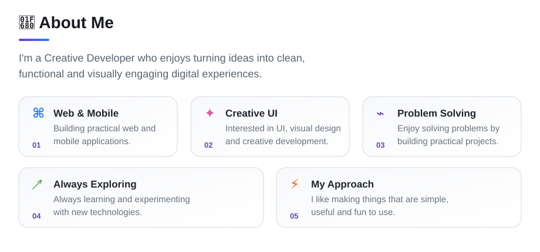
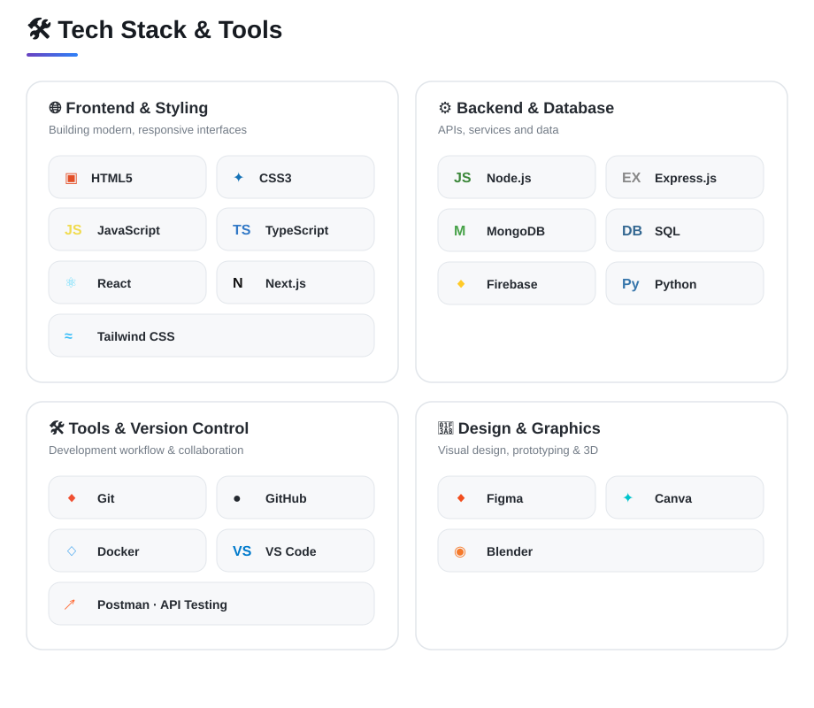
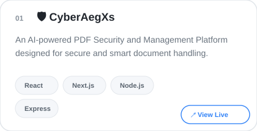
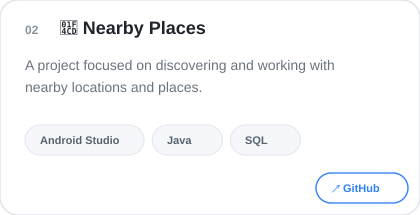
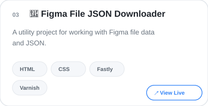
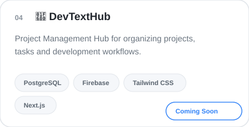
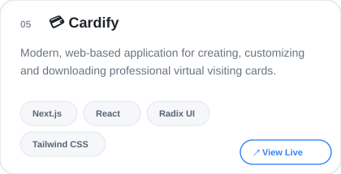
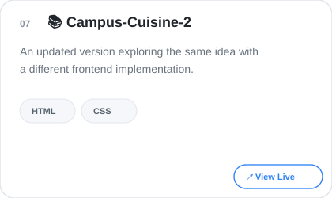
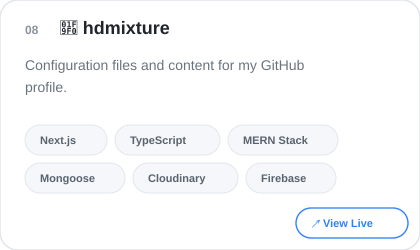
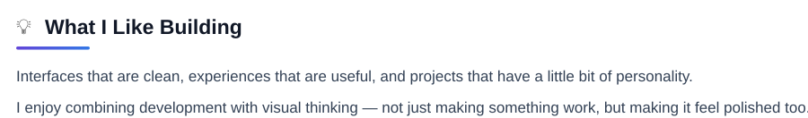

  

  

  

<!--Featured Project-->

  

  &nbsp;
   
  &nbsp;
   
  &nbsp;
   
  &nbsp;
  

<!--📊 GitHub-->

  

  <!-- GitHub Stats -->
  <picture>
    <source
      media="(prefers-color-scheme: dark)"
      srcset="https://github-stats-extended.vercel.app/api?username=hd-mixture&show_icons=true&hide_border=true&theme=github_dark&rank_icon=github">
    <source
      media="(prefers-color-scheme: light)"
      srcset="https://github-stats-extended.vercel.app/api?username=hd-mixture&show_icons=true&hide_border=true&theme=default&rank_icon=github">
    
  </picture>
  &nbsp;
  <!-- Top Languages -->
  <picture>
    <source
      media="(prefers-color-scheme: dark)"
      srcset="https://github-stats-extended.vercel.app/api/top-langs/?username=hd-mixture&layout=compact&hide_border=true&theme=github_dark">
    <source
      media="(prefers-color-scheme: light)"
      srcset="https://github-stats-extended.vercel.app/api/top-langs/?username=hd-mixture&layout=compact&hide_border=true&theme=default">
    
  </picture>

    

  <!-- GitHub Streak (Shifted Left) -->
  <picture>
    <source
      media="(prefers-color-scheme: dark)"
      srcset="https://streak-stats.demolab.com?user=hd-mixture&theme=github-dark-blue&hide_border=true">
    <source
      media="(prefers-color-scheme: light)"
      srcset="https://streak-stats.demolab.com?user=hd-mixture&theme=default&hide_border=true">
    
  </picture>&nbsp;&nbsp;&nbsp;&nbsp;&nbsp;&nbsp;&nbsp;&nbsp;&nbsp;&nbsp;&nbsp;&nbsp;&nbsp;&nbsp;

<!-- Currentely Exploring -->

  

  

  

<!--Social Icons-->

&nbsp;&nbsp;
&nbsp;&nbsp;
&nbsp;&nbsp;

 

  ⭐ <b>If you find something useful here, consider giving it a star!</b>

