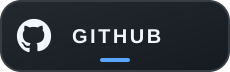
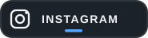

👋 Hi, I'm Darshan Prajapati

Creative Developer • Web & Mobile • Building Things That Feel Good to Use

&nbsp;&nbsp;

&nbsp;&nbsp;

&nbsp;&nbsp;

🚀 About Me

I'm a Creative Developer who enjoys turning ideas into clean, functional and visually engaging digital experiences.

💻 Building web and mobile applications

🎨 Interested in UI, visual design and creative development

🧩 Enjoy solving problems by building practical projects

🌱 Always learning and experimenting with new technologies

⚡ I like making things that are simple, useful and fun to use

🛠️ Tech Stack

Languages & Web

  
  
  
  

Tools

  
  

⭐ Featured Projects

<table>
<tr>
<td width="50%">

🌦️ Weather Visualization

A weather-focused visualization project built to present information in an easy-to-understand way.

Focus: Python • Data Visualization

</td>
<td width="50%">

📍 Nearby Places

A project focused on discovering and working with nearby locations and places.

Focus: Location-based experience

</td>
</tr>

<tr>
<td width="50%">

🎨 Figma File JSON Downloader

A utility project for working with Figma file data and JSON.

Focus: HTML • Web Tools

</td>
<td width="50%">

🍳 Campus Cuisine

A campus-focused web project designed around a practical food-related experience.

Focus: CSS • Web Development

</td>
</tr>

<tr>
<td width="50%">

📚 Campus-Cuisine-2

An updated version exploring the same idea with a different frontend implementation.

Focus: CSS • Frontend

</td>
<td width="50%">

🧰 hdmixture

Configuration files and content for my GitHub profile.

Focus: GitHub Profile • Markdown

</td>
</tr>
</table>

📊 GitHub

<picture>
  <source media="(prefers-color-scheme: dark)" srcset="https://github-stats-extended.vercel.app/api?username=hd-mixture&show_icons=true&hide_border=true&theme=github_dark&rank_icon=github">
  <source media="(prefers-color-scheme: light)" srcset="https://github-stats-extended.vercel.app/api?username=hd-mixture&show_icons=true&hide_border=true&theme=default&rank_icon=github">
  
</picture>

<picture>
  <source media="(prefers-color-scheme: dark)" srcset="https://github-stats-extended.vercel.app/api/top-langs/?username=hd-mixture&layout=compact&hide_border=true&theme=github_dark">
  <source media="(prefers-color-scheme: light)" srcset="https://github-stats-extended.vercel.app/api/top-langs/?username=hd-mixture&layout=compact&hide_border=true&theme=default">
  
</picture>

 

<picture>
  <source media="(prefers-color-scheme: dark)" srcset="https://streak-stats.demolab.com?user=hd-mixture&theme=github-dark-blue&hide_border=true">
  <source media="(prefers-color-scheme: light)" srcset="https://streak-stats.demolab.com?user=hd-mixture&theme=default&hide_border=true">
  
</picture>

🌱 Currently Exploring

Creative Development
        ↓
Modern Web Experiences
        ↓
Better UI & UX
        ↓
Building • Learning • Experimenting

💡 What I Like Building

Interfaces that are clean, experiences that are useful, and projects that have a little bit of personality.

I enjoy combining development with visual thinking — not just making something work, but making it feel polished too.

🤝 Let's Connect

If you're interested in development, design, creative projects or just building cool things, feel free to connect.

<a href="https://hd-mixture.github.io/Portfolio/">Portfolio</a> •
<a href="https://github.com/hd-mixture">GitHub</a> •
<a href="https://instagram.com/hd_mixture">Instagram</a> •
<a href="https://x.com/hd_mixture">X</a>

  

⭐ <b>If you find something useful here, consider giving it a star!</b>

