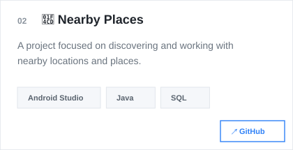
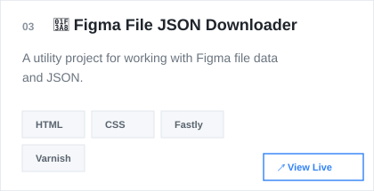
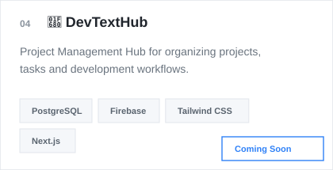
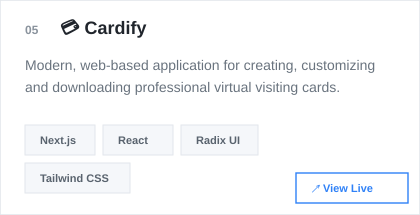
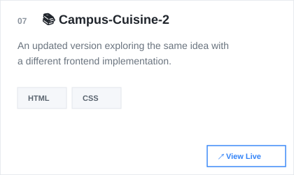
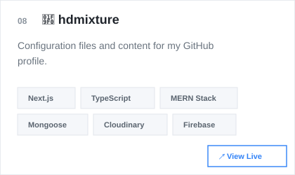

  

  

  

<!-- Featured Projects — GitHub clickable version -->
<table border="0" cellspacing="0" cellpadding="0" width="100%">
<tr>
<td width="50%" align="center" valign="top"></td>
<td width="50%" align="center" valign="top"></td>
</tr>
<tr>
<td width="50%" align="center" valign="top"></td>
<td width="50%" align="center" valign="top"></td>
</tr>
<tr>
<td width="50%" align="center" valign="top"></td>
<td width="50%" align="center" valign="top"></td>
</tr>
<tr>
<td width="50%" align="center" valign="top"></td>
<td width="50%" align="center" valign="top"></td>
</tr>
</table>

📊 GitHub

<picture>
  <source media="(prefers-color-scheme: dark)" srcset="https://github-stats-extended.vercel.app/api?username=hd-mixture&show_icons=true&hide_border=true&theme=github_dark&rank_icon=github">
  <source media="(prefers-color-scheme: light)" srcset="https://github-stats-extended.vercel.app/api?username=hd-mixture&show_icons=true&hide_border=true&theme=default&rank_icon=github">
  
</picture>

<picture>
  <source media="(prefers-color-scheme: dark)" srcset="https://github-stats-extended.vercel.app/api/top-langs/?username=hd-mixture&layout=compact&hide_border=true&theme=github_dark">
  <source media="(prefers-color-scheme: light)" srcset="https://github-stats-extended.vercel.app/api/top-langs/?username=hd-mixture&layout=compact&hide_border=true&theme=default">
  
</picture>

 

<picture>
  <source media="(prefers-color-scheme: dark)" srcset="https://streak-stats.demolab.com?user=hd-mixture&theme=github-dark-blue&hide_border=true">
  <source media="(prefers-color-scheme: light)" srcset="https://streak-stats.demolab.com?user=hd-mixture&theme=default&hide_border=true">
  
</picture>

🌱 Currently Exploring

Creative Development
        ↓
Modern Web Experiences
        ↓
Better UI & UX
        ↓
Building • Learning • Experimenting

💡 What I Like Building

Interfaces that are clean, experiences that are useful, and projects that have a little bit of personality.

I enjoy combining development with visual thinking — not just making something work, but making it feel polished too.

🤝 Let's Connect

If you're interested in development, design, creative projects or just building cool things, feel free to connect.

&nbsp;&nbsp;
&nbsp;&nbsp;
&nbsp;&nbsp;

  

⭐ <b>If you find something useful here, consider giving it a star!</b>

